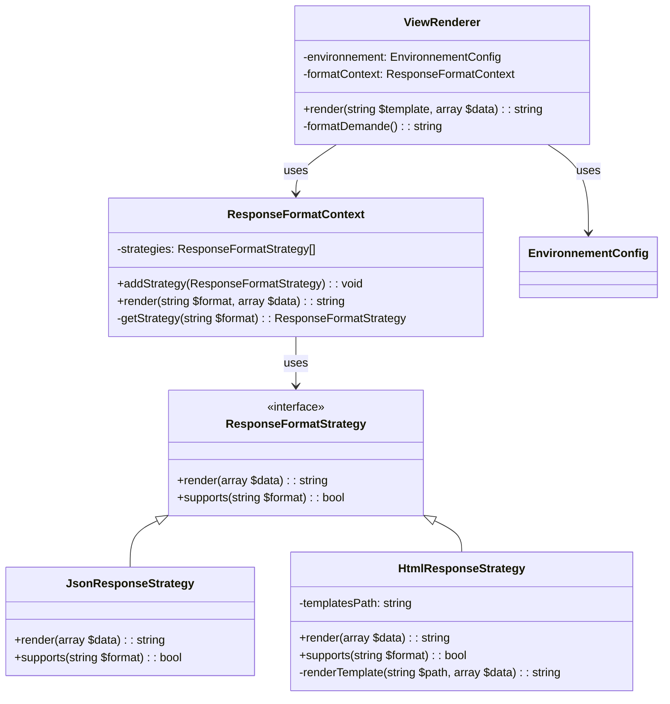

# Implémentation du Design Pattern Strategy pour la Gestion des Formats de Réponse (HTML/JSON)

## Vue d'ensemble

Ce document explique l'implémentation du **Design Pattern Strategy** pour gérer l'affichage des données en format **HTML** ou **JSON** dans l'application de gestion des réservations de salles universitaires.

## Architecture

### Structure des fichiers

```
src/Http/
├── ResponseFormatStrategy.php      # Interface du pattern Strategy
├── JsonResponseStrategy.php        # Stratégie concrète pour JSON
├── HtmlResponseStrategy.php        # Stratégie concrète pour HTML
├── ResponseFormatContext.php       # Contexte qui utilise les stratégies
└── (Reponse.php - SUPPRIMÉE)       # Ancienne classe monolithique

src/View/
└── ViewRenderer.php                # Utilise le contexte Strategy

src/Container/
└── container.php                   # Configuration DI pour les stratégies
```

---

## 1. Interface Strategy : `ResponseFormatStrategy.php`

```php
<?php

declare(strict_types=1);

namespace App\Http;

interface ResponseFormatStrategy
{
    public function render(array $data): string;
    public function supports(string $format): bool;
}
```

### Rôle
Définit le contrat que toutes les stratégies de format doivent respecter.

### Méthodes
| Méthode | Description |
|---------|-------------|
| `render(array $data): string` | Effectue le rendu des données selon le format |
| `supports(string $format): bool` | Vérifie si la stratégie supporte le format donné |

---

## 2. Stratégie Concrète JSON : `JsonResponseStrategy.php`

```php
<?php

declare(strict_types=1);

namespace App\Http;

final class JsonResponseStrategy implements ResponseFormatStrategy
{
    public function render(array $data): string
    {
        header('Content-Type: application/json; charset=utf-8');
        return json_encode($data, JSON_UNESCAPED_UNICODE | JSON_PRETTY_PRINT);
    }

    public function supports(string $format): bool
    {
        return $format === 'json';
    }
}
```

### Caractéristiques
- **En-tête HTTP** : `Content-Type: application/json; charset=utf-8`
- **Encodage** : `JSON_UNESCAPED_UNICODE` (conserve les caractères UTF-8) + `JSON_PRETTY_PRINT` (formatage lisible)
- **Support** : Uniquement le format `'json'`

### Utilisation
```php
$strategy = new JsonResponseStrategy();
$json = $strategy->render(['salles' => [...]]);
// Retourne: {"salles": [...]} avec en-tête JSON
```

---

## 3. Stratégie Concrète HTML : `HtmlResponseStrategy.php`

```php
<?php

declare(strict_types=1);

namespace App\Http;

use RuntimeException;

final class HtmlResponseStrategy implements ResponseFormatStrategy
{
    public function __construct(
        private readonly string $templatesPath
    ) {
    }

    public function render(array $data): string
    {
        $template = $data['_template'] ?? '';
        
        if (empty($template)) {
            throw new RuntimeException('Aucun template fourni pour le format HTML.');
        }

        unset($data['_template']);

        $path = $this->templatesPath . '/' . $template . '.php';

        if (!is_file($path)) {
            throw new RuntimeException('Vue introuvable : ' . $template);
        }

        return $this->renderTemplate($path, $data);
    }

    public function supports(string $format): bool
    {
        return $format === 'html';
    }

    private function renderTemplate(string $path, array $data): string
    {
        extract($data, EXTR_SKIP);
        ob_start();
        require $path;
        return (string) ob_get_clean();
    }
}
```

### Caractéristiques
- **Chemin des templates** : Injecté via le constructeur (`$templatesPath`)
- **Clé spéciale** : Utilise `_template` dans le tableau `$data` pour identifier le template à rendre
- **Moteur de template** : PHP natif avec `extract()` + `ob_start()` / `ob_get_clean()`
- **Gestion d'erreurs** : Lance `RuntimeException` si template manquant ou introuvable
- **Support** : Uniquement le format `'html'`

### Flux de rendu HTML
1. Extrait `_template` des données
2. Vérifie l'existence du fichier template
3. Exécute le template avec les données (via output buffering)
4. Retourne le HTML généré

---

## 4. Contexte : `ResponseFormatContext.php`

```php
<?php

declare(strict_types=1);

namespace App\Http;

use InvalidArgumentException;

final class ResponseFormatContext
{
    /** @var ResponseFormatStrategy[] */
    private array $strategies = [];

    public function addStrategy(ResponseFormatStrategy $strategy): void
    {
        $this->strategies[] = $strategy;
    }

    public function render(string $format, array $data): string
    {
        $strategy = $this->getStrategy($format);
        return $strategy->render($data);
    }

    private function getStrategy(string $format): ResponseFormatStrategy
    {
        foreach ($this->strategies as $strategy) {
            if ($strategy->supports($format)) {
                return $strategy;
            }
        }

        throw new InvalidArgumentException("Format non supporté : {$format}");
    }
}
```

### Rôle
- **Registre des stratégies** : Maintient une liste de stratégies enregistrées
- **Sélection dynamique** : Choisit la bonne stratégie selon le format demandé
- **Extensibilité** : Permet d'ajouter de nouveaux formats sans modifier le code existant (OCP)

### Méthodes
| Méthode | Description |
|---------|-------------|
| `addStrategy(ResponseFormatStrategy)` | Enregistre une nouvelle stratégie |
| `render(string $format, array $data)` | Point d'entrée principal - délègue à la stratégie appropriée |
| `getStrategy(string $format)` | Recherche la stratégie supportant le format |

---

## 5. Intégration dans `ViewRenderer.php`

```php
<?php

declare(strict_types=1);

namespace App\View;

use App\Config\EnvironnementConfig;
use App\Http\HtmlResponseStrategy;
use App\Http\JsonResponseStrategy;
use App\Http\ResponseFormatContext;

final class ViewRenderer
{
    public function __construct(
        private readonly EnvironnementConfig $environnement,
        private readonly ResponseFormatContext $formatContext
    ) {
    }

    public function render(string $template, array $data = []): string
    {
        $format = $this->formatDemande();

        if ($format === 'json') {
            return $this->formatContext->render($format, $data);
        }

        $content = $this->formatContext->render($format, $data + ['_template' => $template]);

        if ($template === 'layout/base') {
            return $content;
        }

        return $this->formatContext->render($format, $data + [
            '_template' => 'layout/base',
            'content' => $content,
            'title' => $data['title'] ?? 'Réservations'
        ]);
    }

    private function formatDemande(): string
    {
        return $_GET['format'] ?? $this->environnement->formatSortie();
    }
}
```

### Logique de rendu
1. **Détection du format** : Via `$_GET['format']` ou config par défaut (`EnvironnementConfig`)
2. **Format JSON** : Rendu direct des données via `JsonResponseStrategy`
3. **Format HTML** : 
   - Premier passage : Rendu du template spécifique (ex: `salle/index`)
   - Deuxième passage : Enveloppement dans `layout/base.php` avec `content` et `title`

### Détection du format
```php
$_GET['format'] ?? $this->environnement->formatSortie()
// Priorité: 1. Paramètre URL ?format=json  2. Variable d'env FORMAT_SORTIE  3. 'html' (défaut)
```

---

## 6. Configuration DI : `container.php`

```php
<?php

declare(strict_types=1);

use App\Config\EnvironnementConfig;
use App\Http\HtmlResponseStrategy;
use App\Http\JsonResponseStrategy;
use App\Http\ResponseFormatContext;
// ... autres imports

return [
    // ... autres définitions
    
    JsonResponseStrategy::class => autowire(),
    
    HtmlResponseStrategy::class => autowire()
        ->constructorParameter('templatesPath', dirname(__DIR__, 2) . '/templates'),
    
    ResponseFormatContext::class => factory(static function (): ResponseFormatContext {
        $context = new ResponseFormatContext();
        $context->addStrategy(new JsonResponseStrategy());
        $context->addStrategy(new HtmlResponseStrategy(dirname(__DIR__, 2) . '/templates'));
        return $context;
    }),
    
    // ...
];
```

### Points clés
- **JsonResponseStrategy** : Auto-wiring simple (pas de dépendances)
- **HtmlResponseStrategy** : Injection du chemin des templates via `constructorParameter`
- **ResponseFormatContext** : Factory qui enregistre les deux stratégies au démarrage

---

## 7. Flux Complet d'une Requête

### Requête HTML (ex: `GET /salles`)
```
1. Router.run('GET', '/salles')
   ↓
2. Dispatcher trouve SalleController::index
   ↓
3. SalleController::index() appelle $this->view->render('salle/index', [...])
   ↓
4. ViewRenderer::render('salle/index', ['salles' => [...]])
   ↓
5. formatDemande() → 'html' (défaut)
   ↓
6. formatContext->render('html', ['_template' => 'salle/index', 'salles' => [...]])
   ↓
7. ResponseFormatContext cherche stratégie supportant 'html'
   ↓
8. HtmlResponseStrategy::render() 
   - Extrait _template = 'salle/index'
   - Charge templates/salle/index.php
   - Retourne HTML du template
   ↓
9. ViewRenderer détecte template !== 'layout/base'
   ↓
10. Deuxième appel: formatContext->render('html', [
        '_template' => 'layout/base',
        'content' => <HTML du step 8>,
        'title' => 'Réservations'
    ])
   ↓
11. HtmlResponseStrategy rend layout/base.php avec content + title
   ↓
12. HTML final retourné au Router → echo → Navigateur
```

### Requête JSON (ex: `GET /salles?format=json`)
```
1. Router.run('GET', '/salles?format=json')
   ↓
2. ... même contrôleur ...
   ↓
3. ViewRenderer::render('salle/index', ['salles' => [...]])
   ↓
4. formatDemande() → 'json' (via $_GET['format'])
   ↓
5. formatContext->render('json', ['salles' => [...]])
   ↓
6. ResponseFormatContext cherche stratégie supportant 'json'
   ↓
7. JsonResponseStrategy::render()
   - header('Content-Type: application/json')
   - json_encode($data, JSON_UNESCAPED_UNICODE | JSON_PRETTY_PRINT)
   ↓
8. JSON retourné directement (pas de layout)
   ↓
9. Router echo → Navigateur (avec en-tête JSON)
```

---

## 8. Avantages du Pattern Strategy

### ✅ Principes SOLID respectés
| Principe | Application |
|----------|-------------|
| **S** (Single Responsibility) | Chaque stratégie a une seule responsabilité (JSON ou HTML) |
| **O** (Open/Closed) | Ajout de nouveaux formats (XML, CSV) sans modifier l'existant |
| **L** (Liskov) | Toutes les stratégies implémentent la même interface |
| **I** (Interface Segregation) | Interface minimaliste avec 2 méthodes ciblées |
| **D** (Dependency Inversion) | `ViewRenderer` dépend de l'abstraction `ResponseFormatContext` |

### ✅ Autres avantages
- **Testabilité** : Chaque stratégie testable indépendamment
- **Maintenabilité** : Logique de rendu isolée par format
- **Extensibilité** : Ajout facile de nouveaux formats (ex: `XmlResponseStrategy`)
- **Séparation des responsabilités** : Contrôleurs ne gèrent pas le format de sortie

---

## 9. Ajout d'un Nouveau Format (ex: XML)

### 1. Créer la stratégie
```php
// src/Http/XmlResponseStrategy.php
final class XmlResponseStrategy implements ResponseFormatStrategy
{
    public function render(array $data): string
    {
        header('Content-Type: application/xml; charset=utf-8');
        // Logique de conversion array → XML
        return $xmlString;
    }

    public function supports(string $format): bool
    {
        return $format === 'xml';
    }
}
```

### 2. Enregistrer dans le container
```php
// container.php
XmlResponseStrategy::class => autowire(),

ResponseFormatContext::class => factory(static function (): ResponseFormatContext {
    $context = new ResponseFormatContext();
    $context->addStrategy(new JsonResponseStrategy());
    $context->addStrategy(new HtmlResponseStrategy(...));
    $context->addStrategy(new XmlResponseStrategy()); // ← Nouveau
    return $context;
}),
```

### 3. Utilisation immédiate
```
GET /salles?format=xml → Retourne XML automatiquement
```

---

## 10. Configuration Environnement

### Variable d'environnement (.env / .env.docker)
```env
FORMAT_SORTIE=html  # Défaut: 'html', valeurs possibles: 'html', 'json'
```

### Priorité de détection
1. **Paramètre URL** : `?format=json` (priorité haute, pour tests/API)
2. **Variable d'env** : `FORMAT_SORTIE=json` (configuration globale)
3. **Défaut** : `'html'` (fallback)

---

## 11. Tests de Vérification

### Test HTML (défaut)
```bash
curl http://localhost:8080/salles
# Retourne page HTML complète avec layout
```

### Test JSON
```bash
curl http://localhost:8080/salles?format=json
# Retourne JSON avec header Content-Type: application/json
```

### Test via variable d'env
```bash
# Dans .env.docker: FORMAT_SORTIE=json
docker compose restart app
curl http://localhost:8080/salles
# Retourne JSON par défaut
```

---

## 12. Fichiers Modifiés/Créés Résumé

| Fichier | Action | Description |
|---------|--------|-------------|
| `src/Http/ResponseFormatStrategy.php` | **Créé** | Interface du pattern Strategy |
| `src/Http/JsonResponseStrategy.php` | **Créé** | Stratégie de rendu JSON |
| `src/Http/HtmlResponseStrategy.php` | **Créé** | Stratégie de rendu HTML |
| `src/Http/ResponseFormatContext.php` | **Créé** | Contexte gérant les stratégies |
| `src/View/ViewRenderer.php` | **Modifié** | Utilise ResponseFormatContext |
| `src/Container/container.php` | **Modifié** | Enregistre les stratégies en DI |
| `src/Http/Reponse.php` | **Supprimé** | Ancienne classe monolithique |

---

## 13. Diagramme de Classes (Mermaid)



---

## Conclusion

L'implémentation du **Pattern Strategy** permet une gestion propre, extensible et maintenable des formats de sortie. L'architecture respecte les principes SOLID et facilite l'ajout futur de nouveaux formats (XML, CSV, PDF, etc.) sans impact sur le code existant.